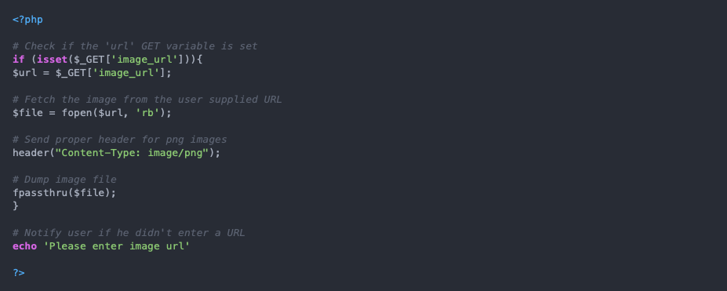

# Server-Side Request Forgery

## Summary

Web applications can have a functionality to import data from, publish data or read data from a URL that can be tampered with. 

* An attacker can exploit the calls to this functionality by supplying or modifying a URL.
* When the modified request goes to a server, the server-side code picks it up and tries to read data to the URL. 
* By carefully selecting target URLs, an attacker can be able to read data such as AWS metadata, database HTTP interfaces and files that are not directly exposed to the internet. 

## Solution

- [x] Whitelist the hostname or IP that your application needs to access
- [x] Ensure that the received response from the request sent by the server is as expected
- [x] Enable authentication for all services, including ones on the local network 

## Further Reading

* <https://www.invicti.com/blog/web-security/server-side-request-forgery-vulnerability-ssrf/>
* <https://www.hacksplaining.com/exercises/ssrf#>
* <https://cwe.mitre.org/data/definitions/918.html>

