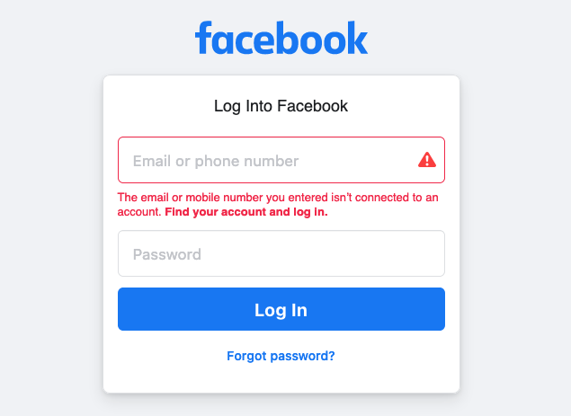

# Username enumeration (generic)

## Summary

Username enumeration is a popular vulnerability that affects all types of applications. It happens when a malicious actor is able to build up a list of valid usernames from the application or system. 

* This practice is pretty common in all kinds of applications, but web apps are especially vulnerable to this type of risk, due to the validation controls that can let the attacker know if some users are invalid or not due to the usage of ‘Invalid username’ and similar messages.
## Solution

- [x] Avoid displaying validation messages like “Invalid username” to the end-users.
- [x] Rate limit login attempts per IP and username.
## Further Reading

* <https://www.rapid7.com/blog/post/2017/06/15/about-user-enumeration/> 
* <https://owasp.org/www-project-web-security-testing-guide/latest/4-Web_Application_Security_Testing/03-Identity_Management_Testing/04-Testing_for_Account_Enumeration_and_Guessable_User_Account> 

